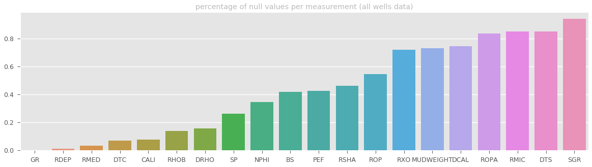
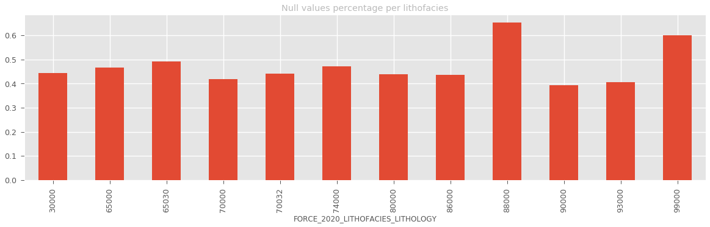
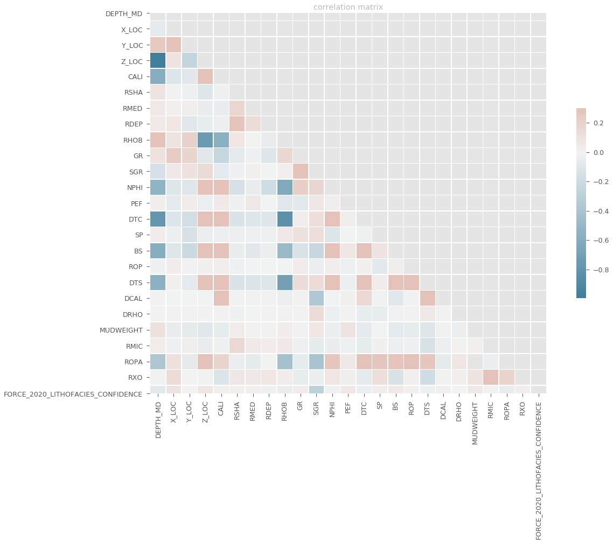

# machine-predicted-lithology
FORCE Competition :  Create a machine learning model that has the highest accuracy in prediction lithology from a suite of wireline logs

The provided datasets (train.csv, test.csv) contain well logs and interpreted lithofacies.
This competition is well suited for people with some background in geosciences. I don't have any background in geosciences so my approach is fully data driven.

To have a full overview of the problem and data, please visit the competition website at https://xeek.ai/challenges/force-well-logs/overview

## REPOSITORY FILES DESCRIPTION
 * data_analysis.ipynb : details on some analysis and vizualisation I did on the data.
 * data_processing.ipynb : details on how data have been processed (imputation, scaling and encoding)

## Data Analysis (data_analysis.ipynb)
First of all, we started by looking at the provided data to get a better understanding and extract some insights on how features are linked to target (lithofacies labels). All detailed steps are available inside "data_analysis.ipynb" notebook.

Some of the insights we got/verify are:

* There are some spikes in data. They can be due to data acquisition errors or rock layers transition. We will threshold those values during data processing since we won't try to capture layers transition.
* Figure below shows that there are a large amount of null values. Some logs like ROPA, RMIC, DTS and SGR even have more than 80% of null values. Therefore one of the main challenges will be to find the most discriminative logs for our classification task. Also we should find the best way to fill those empty values.

* The only log with no missing value is GR
*  Our targets (lithofacies) have the similar amount of null values except of 88000 and 99000 with more than 60% of null data.

* Logs correlation

Correlation matrix above shows that many logs are higly correlated (RHOB, NPHI, DTC, DTS,...). This can be very useful to fill null values.
* Also, some logs are very discriminative for lithofacies classification:
    * RSHA, RMED,RDEP bring out very clearly lithofacies 86000, 88000 and 93000. 
    * Same thing for BS and 99000 
    * Same thing for DTS,RXO and 86000. Thus we will make sure to keep those logs during modelisation.

## Data processing (data_processing.ipynb)
Many processing steps have been applied to our data
* **Data splitting**: We split our data in 3 sets train/val/test. The splitting is done per well to make sure samples of the same well fall within the same set. This way, our training is well-independent and thus we can expect a better generalization during testing and production. We keep 2 wells for validation and 2 wells for test set. The remaning wells are used for training the classifier.
* **Features selection**: There is a lot of features in our dataset. According to our previous data analysis, we realize that some of them are not quite useful for our classification task and others like SGR or RMIC have more than 80% of null values. Therefore we decided to remove those features from our data. We've also trained a RandomForestClassifier to get a sense about the most "important" features. After that, we decided to keep the following logs: 'RMED','RDEP','RHOB','GR','NPHI','DTC','RXO','RSHA',"X_LOC","Y_LOC","Z_LOC",'DEPTH_MD', 'GROUP' and 'FORMATION'.
* **Processing pipeline**: This pipeline involves data imputation, numeric features scaling and categorical features encoding.  To impute numeric features, we used an iterative imputer (from sklearn) which iteratively predict features null values using others features. This is done with a Bayesian approach. For more information on this method, please visit : https://scikit-learn.org/stable/modules/generated/sklearn.impute.IterativeImputer.html.
Finally , to impute GROUP and FORMATION, we trained 2 classifiers using numeric features as input. We think this method yields a better result than just filling those features with the mode. All this processing has been trained on our train set only. We only applied it on val/test sets to make sure we are not leaking information before the training phase.
* We saved the processed data and the processing pipeline for the next step. More details on this processing step are available in data_processing.ipynb 